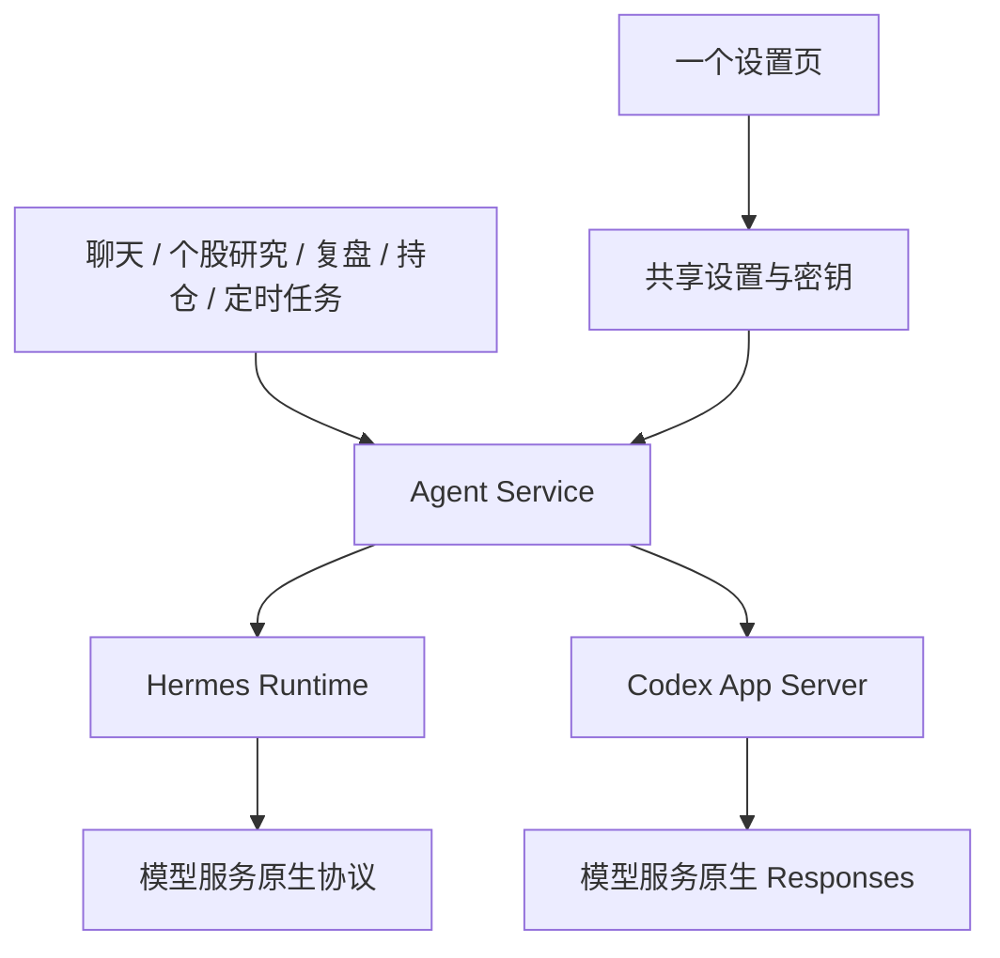

# Codex / Hermes 双 Runtime

实现分支：`codex/dual-agent-runtime`，基于开源 `oss-main`。本文记录本次实现的结构与边界。

## 产品行为

- 设置页只有一个全局运行引擎选择器：Hermes / Codex，默认沿用 Hermes。
- 两个引擎共享模型档案、当前模型、密钥、思考强度、Skills、MCP；无需分别填写。
- AI 对话、个股研究、持仓巡检、持仓明日预期、复盘、联网题材识别、浏览器内容归纳和连接测试通过同一个 Agent Service 调用。
- 保存后，新请求使用所选引擎。多阶段任务在启动时冻结引擎、模型、密钥、工具设置和 Skill 文件，子任务沿用该快照。
- 已生成报告保留原结果；切换不会自动重跑历史报告。新研究报告及使用量记录保存 runtime 来源。

## 原生模型协议

不引入模型协议代理或转换层。Codex 固定 `wire_api = "responses"`，由其原生客户端直接访问用户配置的 Base URL。

新增模型配置默认选择“Responses API”，下拉菜单首项也是 Responses；Anthropic 服务商沿用其原生 Messages。已保存配置继续显示保存的协议。智谱 GLM 默认使用 `/api/v1` 与 `glm-5.3-flash`；切换协议时，在已知官方默认地址之间同步切换（Responses `/api/v1`、Chat Completions `/api/paas/v4`、Messages `/api/anthropic`），自定义代理、其他套餐地址保持原样。共用 Base URL 的服务商无需改址。

用户仍可选择“自动检测（优先 Responses）”。此时保存活动模型会发送一次很短的原生 `/responses` 请求：

1. 返回有效 Responses 结果：将共享模型协议保存为 Responses，两端使用同一个连接。
2. 服务明确不支持 Responses：Hermes 可以使用其原生 Chat Completions / Anthropic Messages；选择 Codex 的保存操作返回 `MODEL_PROTOCOL_UNSUPPORTED`，原设置保持有效。
3. 认证失败、模型无权访问、限流、网络错误、超时或响应格式不明确：提示能力尚未确认，保留原设置。

从旧配置切换到 Codex、在 Codex 下更换模型地址/型号/密钥时重新检测。手工协议选项仍用于已知连接。检测结果不会跨模型、地址或凭据推断。

Responses 是必要条件；服务还必须接受固定版本 Codex 发出的原生请求及工具格式。实际运行失败直接返回错误，不转换协议、不自动换引擎。“保存并测试连接”通过当前引擎执行真实的无工具短请求。

智谱 GLM 的原生 Responses 地址为 `https://open.bigmodel.cn/api/v1`，与 Chat Completions 的 `/api/paas/v4` 地址不同（[官方说明](https://docs.bigmodel.cn/cn/guide/develop/responses/introduction)）。它的 `/models` 返回 Codex 模型目录 `models[].slug`；模型发现同时读取该格式和标准的 `data[].id`，无需更换推理地址。获取列表支持“自动检测”选项，但不触发推理或改变已保存的协议。目录为空时允许手动输入模型并测试连接；HTTP 200 中的服务错误也会明确提示，不能据此判断模型不支持 Responses。

## 公共执行层



`backend/internal/agent` 定义公共 `Gateway` / `Prompter` / `PromptOptions`、结果、状态和使用量；业务包不再导入 Hermes 专属包。`Service` 负责配置同步、选择引擎、任务快照和失败回滚。

Hermes 保留既有实现与启动器。Codex 使用独立 App Server 子进程，通过 stdio JSONL 完成初始化、原生 thread/turn、文本与 reasoning 流、工具状态、取消、审批、澄清和用量事件。适配器将这些事件转换为应用已有的 WebSocket 协议，因此无需让业务组件分别理解两个原生协议。

命令/文件审批保留一次、会话及拒绝选项；权限审批展示申请内容后映射授权范围。MCP 表单澄清支持基本文本、数值、布尔和枚举字段。需要在外部完成的 MCP URL 认证仍由用户在服务侧处理。

## 一个配置来源

为兼容已有安装，本次沿用应用拥有的 `hermes-home/config.yaml`、`.env` 和 `skills/` 作为共享持久化来源；目录名称不会形成第二套设置。一般 `settings.json` 不保存模型明文密钥。

重新打开设置时，已保存的模型密钥显示为圆点。只有点击眼睛按钮才按模型配置 ID 读取明文，响应禁止缓存；普通设置接口继续只返回配置状态。查看不产生密钥修改，隐藏、切换配置或关闭设置后清除页面中的查看结果。

思考档位共用模型能力策略：Responses 模型目录中的 `supported_reasoning_levels` 和 `default_reasoning_level` 用于展示及校验选项，Codex 原生传入 `reasoning.effort`。智谱官方 Responses 地址的 GLM-5.3 / GLM-5.3-Flash 支持低、高、最大三档，默认最大；旧版“能力未知”缓存会自动失效。协议之间不转换参数，未声明的模型不套用其他模型的档位。

### 提供商思考设置（2026-09-30 核对）

按“地址 + 协议 + 模型”识别能力；官方规则作后备，模型目录的明确能力声明优先。两端共享所选值。只声明 `reasoning: true` 不等于支持任意档位，未知模型显示“能力未确认”，固定思考模型显示“固定思考”。

| 提供商 | 已接入的原生控制 | Codex 边界 |
| --- | --- | --- |
| OpenAI | 已知 GPT 模型按型号提供档位；GPT-6.1 Sol / Astra 为低、中、高、极高、最大 | 原生 Responses |
| DeepSeek | Flash 为关闭、低、高、最大；不展示服务端会合并的 medium / xhigh | Flash 原生 Responses |
| Kimi | K3 为低、高、最大，不允许关闭；K2.5 / K2.6 为开关 | K3 原生 Responses；旧型号不能套用 K3 能力 |
| MiniMax | M3.1 Flash Preview 为低、中、高、极高、最大；M3 为开关；M2.x 固定思考 | 原生 Responses；M3 开启以 `medium` 表达开关，不代表独立中档 |
| GLM | 5.3 / 5.3 Flash 为低、高、最大；其余已知 Chat 型号按原生能力 | `/api/v1` 原生 Responses |
| 通义千问 / 百炼 | Qwen3.8 Responses 的有效档位为关闭、低、中、极高；已知 Chat 混合模型为开关及 1024 / 4096 / 8192 Token 预算 | 使用控制台的 `*.maas.aliyuncs.com/compatible-mode/v1` 工作空间地址；不猜测用户空间或迁移密钥 |
| 硅基流动 | 文档列明的混合模型使用开关及 1024 / 4096 / 8192 Token 预算，界面标明预算 | 这些规则仅适用于原生 Chat，不转换成 Responses |
| Anthropic | 已知现代 Claude 通过 `output_config.effort`；旧 Sonnet / Opus 通过原生思考预算 | 原生 Messages 由 Hermes 执行，Codex 不转换协议 |
| 自定义接口 | 明确的 `supported_reasoning_levels`（Responses）或 `supported_reasoning_efforts`（Responses / Chat）目录声明；无声明不猜测 | 必须真实支持原生 Responses |

预算表示思考 Token 上限，不承诺固定消耗或推理质量。模型能否调用、账号权限及整套工具请求是否兼容，仍由连接测试确认。能力缓存版本升级后重新解析；`responses` 与 `codex_responses` 使用同一个缓存键。

回归包含九类提供商的能力、协议隔离与共享设置保存；包内 Hermes 原生 transport 参数测试；包内 Codex 对本地 Responses 服务的逐档测试（普通聊天及无工具分析两种模式）。没有用模拟服务的成功替代供应商线上验收。

依据：[DeepSeek](https://api-docs.deepseek.com/guides/thinking_mode)、[Kimi](https://platform.kimi.com/docs/guide/use-reasoning-effort)、[Kimi Responses](https://platform.kimi.com/docs/api/responses)、[MiniMax](https://platform.minimax.io/docs/api-reference/responses-create)、[百炼](https://help.aliyun.com/zh/model-studio/qwen-api-via-openai-responses)、[硅基流动](https://docs.siliconflow.com/en/api-reference/chat-completions/chat-completions)、[Anthropic](https://platform.claude.com/docs/en/build-with-claude/effort)、[OpenAI](https://developers.openai.com/api/docs/guides/reasoning#reasoning-effort)。

Codex 的 TOML 是生成文件：

- 同步当前模型、Base URL、思考强度、响应等待时间与 MCP 设置。
- 模型密钥和 MCP 凭据仅传入子进程环境；生成 TOML 不重复保存这些值。
- stdio MCP 通过包内 Python 启动，按服务器注入环境变量；HTTP MCP 使用原生 Streamable HTTP；旧 SSE MCP 通过 Python MCP SDK 转为 stdio。该适配只处理 MCP 传输，不涉及模型请求。
- 启用的 Skills 按实际目录投影到 Codex 的 Skill 目录；名称与磁盘目录不同、无分类及嵌套分类均可处理。可执行脚本保留执行权限。
- 模型配置、密钥及 Skill 内容参与 Codex 配置代际标识。删除或更新 Skill 后，下次请求使用新的目录，不沿用旧资源。

模型设置保存通过 `Store.UpdatePrepared` 与 `Service.PrepareSettings` 协调：生成文件成功后持久化设置并激活；失败恢复文件与内存状态。应用启动以持久化模型档案重新生成两端配置。这是现有本地文件存储上的协调保存，并非跨文件系统的数据库事务或新的系统钥匙串。

## 会话和任务

产品仍使用原有聊天存储格式，新增通用 `agent_session_id` / `agent_model_key`，兼容读取旧 `hermes_*` 字段。会话绑定包含 runtime、模型档案与连接信息。

每次发送前读取最新设置，并携带配置标识交给后端复核；发送与保存竞争时拒绝过期请求，避免标签与实际引擎不一致。切换引擎或模型后，用最近可见历史创建新的原生会话；切回时包含中间新增内容。原生恢复失败也可从可见历史重新创建。沿用既有历史数量限制，不迁移原生隐式记忆或完整内部推理状态。

后台工作通过 `BindTask` 冻结配置。持仓工作及多阶段研究把同一个 context 传给子任务，切换不再取消正在运行的旧任务。内置研究工具复用现有 Python 工具实现，Codex 负责模型推理和调用决策，不通过 Hermes 模型执行一轮代理。

## 工具策略与进程隔离

- 交互聊天使用应用工作区和显式审批。
- 无工具分析：使用 Codex 原生模型目录及工具开关，关闭 shell、patch、image、用户澄清、计划、目标及外部 MCP；真实请求测试断言 `tools` 为空。
- 允许联网/计算的后台任务：临时工作区、不加载用户 MCP/Skills，仅暴露与 `PromptOptions.Toolsets` 一致的内置 MCP 工具。Python 计算沿用项目已有的严格沙箱及文件/网络审计约束。
- 使用显式浏览器登录态的采集任务通过同一浏览器工具读取页面；登录仍由应用界面完成。
- `CODEX_HOME`、子进程 `HOME` / `USERPROFILE` 均指向应用自有目录，不读取或修改用户全局 Codex 登录和配置。关闭 Codex 自带 Skills，避免产生设置页以外的第二套 Skill 列表。
- 正常结束通过 stdin EOF 让 App Server 回收 MCP；超时再终止进程树。Windows 使用进程树终止，Unix 同时处理独立进程组的 MCP 子进程。

## 安装和开发

`desktop/codex-runtime-lock.json` 固定 Codex **0.159.0** 的各平台原生 npm 归档及 SHA-512 摘要。

当前桌面发布矩阵保持：macOS arm64、macOS x64、Windows x64。每个安装包只包含对应平台架构的 Codex；完整保留上游 `bin/`、辅助程序和资源目录，并携带 LICENSE / NOTICE。Linux 与 Windows arm64 的锁信息供扩展使用，不代表已有完整桌面发行支持。

`prepare-package.mjs` 下载并验证归档，运行二进制版本检查和 App Server 握手，再执行真实 Codex 对本地模拟 Responses/MCP 服务的测试。`verify-release-package.mjs` 检查包内 Codex，禁止打包用户 `codex-home` 或 `auth.json`。客户端使用绝对包内路径，运行时不依赖全局 npm/Codex 或首次启动下载。

开发启动 `npm run dev:desktop` 会准备两个运行时。离线构建可设置 `CODEX_RUNTIME_ARCHIVE` 指向已下载归档，仍强制校验锁定摘要。

原生集成测试示例（在 `backend/` 执行）：

```sh
EASY_STOCK_CODEX_TEST_BINARY="$PWD/../desktop/resources/codex-runtime/bin/codex" \
EASY_STOCK_HERMES_TEST_PYTHON="$PWD/../desktop/resources/hermes-runtime/venv/bin/python" \
go test ./internal/agent -run 'TestCodexNative|TestBuiltinMCP' -count=1
```

Windows 使用包内 `bin/codex.exe` 和 `hermes-runtime/python/python.exe`。测试模型服务为本地模拟服务，不需要真实模型账号或付费请求。

## 验证范围

新增用例覆盖：原生 Responses 检测分类、选择失败不激活、配置回滚、任务快照、Skill 资源变更、旧历史迁移、原生文本/用量、审批/澄清/取消协议、真实 Skill 发现、stdio/SSE MCP、内置 MCP 握手和计算调用、归档摘要及平台锁。

已通过 Go 全量测试、Agent/设置/HTTP 的 race 测试、前端 146 项测试与生产构建、桌面 59 项测试（1 项按环境跳过）、macOS arm64 原生进程集成测试及 Windows 后端交叉编译。macOS x64 / Windows 安装包的实际启动、签名和安装仍需对应发布 runner 完成；准备脚本已把原生检查作为构建门槛。真实供应商与模型支持范围以用户的连接测试为准。

## 官方依据

- [App Server](https://learn.chatgpt.com/docs/app-server)
- [配置参考](https://learn.chatgpt.com/docs/config-file/config-reference)
- [高级配置](https://learn.chatgpt.com/docs/config-file/config-advanced)
- [环境变量](https://learn.chatgpt.com/docs/config-file/environment-variables)
- [MCP](https://learn.chatgpt.com/docs/extend/mcp)

关联讨论：[先前任务](codex://threads/01a0ec5d-0635-7213-b59f-99f6425821a5)。
