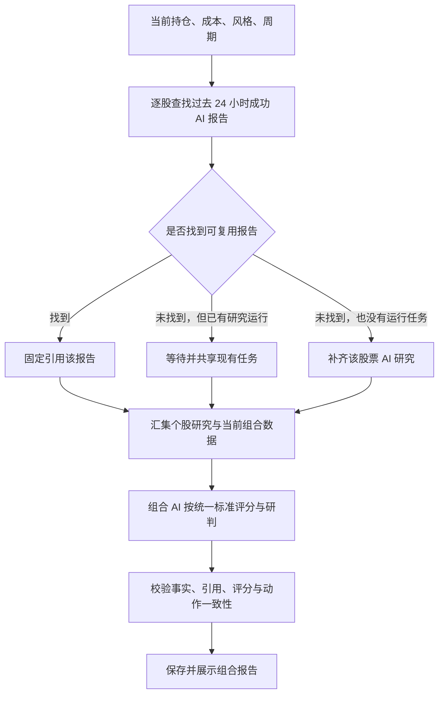

# 持仓 AI 分析重设计方案

状态：已实现第一版。适用版本：开源版。

实现说明：报告复用采用与原任务表联动的独立 SQLite 查询索引；旧任务在打开数据库时幂等回填，无需改变原报告 JSON。组合事实、AI 四维评分和静态止损预算分别呈现，历史 v2 报告继续使用原展示方式。

组合输出的说明列表以字符串数组为标准格式；模型返回包含明确文字字段的对象时，在模型边界转换为文字，同时将引用与涉及股票保存在 `explanation_details` 中，随报告持久化并展示。主要风险、结构发现、处理顺序、核验清单、数据限制及维度限制共用此兼容逻辑。无有效文字、未知嵌套字段、虚构来源、不可用事实或非持仓股票仍须修复；评分和引用校验不放宽。校验失败的诊断及有长度限制的原始输出写入本机日志，界面提示重试，恢复任务仅重试组合评估。

## 目标

持仓分析先获得每只股票的成功 AI 研究报告，再结合当前仓位、成本、现金、交易风格与持有周期，完成一次组合 AI 评估，输出评分、风险解释和行动顺序。

过去 24 小时内已经完成的个股 AI 报告直接复用，包括在个股分析页和此前持仓巡检中生成的报告。只有缺少有效报告的股票才启动研究。没有静态止损价格不再阻断组合评分。

## 现有实现与需要替换的环节

- `backend/internal/httpapi/stock_research.go` 的 `analyzeHoldingResearch` 每次调用 `ResearchService.Start`；没有查询近一天成功报告的步骤。
- `ResearchService` 目前按整个研究请求合并正在执行的任务。成本、用途或周期不同，会形成不同请求，无法满足持仓按股票复用的需求。
- `ResearchStore` 已保存完整报告、证据、研究时点与请求，持仓发起的研究也进入同一报告库，可以直接扩展，无需维护第二套个股研究缓存。
- `portfolioinspection/service.go` 已有组合 AI 汇总，但提示词要求复制旧量化评分，服务又覆盖 AI 返回的健康度、风险等级与风格判断。现有评分无法真正综合个股 AI 研究。
- 旧健康度要求有效静态止损覆盖至少 70%；旧风险韧性计算还把未知止损风险当作零值参与运算。这两个评分不能直接沿用或仅解除前端隐藏。
- `awaitStockResearch` 目前只检查是否存在 `Analysis`。新流程必须检查任务成功且 AI 报告完整，不能把失败任务保留的量化快照当成研究成功。

## 1. 用户流程

保留当前持仓录入界面：交易风格、股票、占总资产的仓位、可选成本。增加一个组合持有周期：超短、波段、中期，默认波段。

点击“开始持仓分析”后自动完成以下流程，不增加必须经过的确认页：

进度显示实际情况，例如“4 只持仓：复用 3 份报告，补充研究 1 只”，并分别显示“复用完成 / 等待已有研究 / 正在研究 / 研究失败”。全部命中时直接进入组合评估。

补齐研究默认使用标准模式，可在高级选项选择深度；该选择只影响缺少报告的股票。命中快速模式的成功报告时照样复用，不自动升级重跑。

“再次分析组合”默认继续复用个股报告。需要更新时，用户可以对指定股票执行“重新研究”，这是显式绕过复用规则的操作。

## 2. 个股报告复用规则

### 时间与选择

- “一天”定义为滚动 24 小时，不按午夜清空，也不自动按交易日失效。
- 以原报告成功完成时间计算：`0 <= request_time - report_completed_at < 24h`。
- 查找规范化股票代码对应的最新有效成功报告，时间相同时优先信息更完整的研究层级。
- 不使用最后查看时间、核验时间或 `updated_at` 延长有效期；一次组合分析中复用的报告不会因此变成新报告。
- 启动组合任务时固定报告选择；后续等待其他股票时，不因报告刚好跨过 24 小时边界而再研究一次。
- 超过 24 小时的旧报告仍可查看，但默认不作为本次有效复用报告。

### 合格报告

同时满足：任务 `succeeded`、AI 状态 `ready`、存在完整结构化 `ResearchReport`、已通过相应的引用和结构校验。快速、标准、深度均可。

量化速览、失败、中断、取消、降级结果，以及尚未完成的 AI 阶段不算合格报告。最新研究失败时，继续查找窗口内更早的成功报告，不让失败记录挡住可用报告。

报告版本只要求能正确读取核心研究与引用。更换模型、调整思考设置或普通提示词升级，不自动清空一天内成功报告；真正无法读取或确认结构完整性的旧数据才不符合复用条件。

### 用途、成本、周期与深度

股票代码是复用的主要依据。用途、持仓成本、仓位、交易风格、请求深度与组合周期变化，不自动触发个股重研究。

复用的是公司事实、近期交易逻辑、支持与反对证据、风险、条件和资料缺口。原报告为“观察”或“准备新开仓”生成时，其最终动作不直接移植为“已有持仓”的动作；原成本不用于新组合盈亏计算。

组合 AI 使用本次输入的真实成本、仓位与持有周期重新判断。短周期报告不能直接证明中期趋势；保留原研究周期、层级和证据范围，明确标注由此产生的评估限制，但不自动重跑个股。

### 行情时点

复用研究不等于将旧行情标成实时行情。报告分别保留“研究完成时间”“研究证据截止时间”“行情时间”。继续研究后才完成的报告，其证据可能明显早于完成时间，必须显示这个差异。

组合阶段可批量刷新行情等基础量化快照，不重跑个股 AI；刷新失败时使用原快照并显示时点。新行情与旧研究分别存放，原个股报告不可改写。

可用新行情检查可计算的价格条件；公告变化、主营变化等语义条件若没有新证据，标为未核验。不得因为刷新了报价，就声称整个研究已经更新或所有条件仍然成立。

### 正在执行与持久化

如果同股已有正常运行的研究，持仓流程等待它完成，不再启动另一份研究；结束后按成功报告标准检查。窗口内已有成功报告时直接复用，不等待另一份正在运行的更新研究。

查找、接入正在运行的任务、决定启动新任务，集中在研究服务内执行，并在同一锁保护下完成，避免“先查无报告、同时各建一份”的竞态。沿用现有全局个股并发上限 2。

持仓不拥有被共享研究的取消权；取消持仓分析仅停止它自己的等待和组合汇总。其他消费者仍可等待原个股任务。服务重启沿用现有中断标记，不无限等待已经不存在的任务。

成功报告存入当前 SQLite 报告库，因此应用重启不影响复用。第一版只在持仓入口自动执行复用；个股页用户明确发起的新研究保留现有语义。

## 3. 组合 AI 的输入与职责

组合阶段接收：

1. 本次真实持仓、现金、可选成本、交易风格、组合周期。
2. 每股成功研究的摘要：主营与交易主线、支持和反对证据、趋势背景、催化、主要矛盾、失效条件、证据强弱、缺口。
3. 每份原报告的 ID、用途、周期、研究层级、完成时间与证据截止时间。
4. 可复算的事实：单票与前三大仓位、现金、可用的波动/历史回撤、同日期收益相关性、成本盈亏等；每项有计算方法、样本窗口、时点与可用状态。
5. 引用所需的最小证据目录，保留原报告 ID 与来源 ID 的映射。

AI 回答的是：这组股票放在一起是否合理、主要收益逻辑与共同风险是什么、哪些持仓值得保留、哪些优先处理、哪些条件需要后续观察。不能只把四份个股报告逐条拼接，也不能只按旧规则行业标签归类。

共同风险同时检查产业链、近期交易主线和量价联动。例如不同主营可能共同受半导体行情影响；同属电子行业也不一定有同一交易逻辑。统计相关性与 AI 对共同驱动的判断分别展示。

多题材股票允许出现在不同风险分组中，但分组占比不可直接相加当作总仓位。相同风险在综合评分中只扣一次主要分数，其他维度可解释其影响。

组合评估只使用提供的证据包，不重新发起逐股检索或完整研究。原文属于资料，不能作为指令执行。限制摘要长度和来源数量，保留反证、限制与必要引用，避免十份完整原文堆入一次模型请求。

## 4. 评分方案

评分表达当前持仓在指定目标下的研究评价，不表示胜率或收益预测。第一版建议四个维度，分数越高越好：

| 维度 | 权重 | AI 需要评估的内容 |
| --- | ---: | --- |
| 持仓逻辑质量 | 35% | 仓位加权后的个股持有理由、证据强弱、趋势阶段、催化持续性与反证，区分“逻辑已成立”和“仍待验证” |
| 组合结构合理性 | 25% | 单票集中、交易主线重叠、产业链共同暴露、组合角色互补；现金风险缓冲在下一维度评估，避免重复扣分 |
| 风险承受能力 | 25% | 已知波动与回撤、高风险持仓暴露、现金缓冲、失效条件是否清晰且能执行；未知数据明确列出 |
| 策略匹配度 | 15% | 持仓逻辑和行动计划是否符合组合周期与交易风格，避免超短理由支撑中期持有、弱逻辑大仓位等错配 |

AI 为每个维度输出整数分数、判断理由、主要加扣分项和证据引用。后端只校验并计算总分：

`综合评分 = round(逻辑质量 × 0.35 + 结构合理性 × 0.25 + 风险承受能力 × 0.25 + 策略匹配度 × 0.15)`

不再把旧 `WeightedScore` 或旧健康度强制覆盖为 AI 评分。量化分数保留在可展开的量化基线中，不能再以“AI 综合评分”名义展示。

### 统一尺度与校验

- 每个维度采用相同的基础档位：80～100 明显较好，60～79 基本合理但有问题，40～59 有明显缺陷，0～39 主要条件严重不足。具体分数须说明处于该档位的依据。
- 提示词固化各维度的评价项及反例，不让 AI 每次自行改变维度、权重或高低分方向。
- 风险等级由组合 AI 独立给出依据，不直接从总分推导；良好持有逻辑可能同时伴随高风险。二者并排展示。
- 置信度单独显示高/中/低及理由，主要反映覆盖、研究证据强弱、数据时效和重要缺口，不与综合分数混为一谈，也不机械乘入总分。
- 校验分数范围、必填解释、引用真实存在、股票属于本次持仓、总分计算正确、动作与已知限制一致。
- 对数值集中度、现金和可用风险事实做一致性校验。例如正文承认高集中，却把结构评价描述为“充分分散”，应要求修正。高分例外必须给出可检查的解释，而非一律套固定扣分公式。
- 相同输入和评分版本仍可能受模型影响产生小幅波动；保存模型、评分版本与输入引用，便于回溯，不承诺逐分稳定。

### 静态止损从总分中解耦

缺少固定止损价时，仍可根据已有研究、风险暴露和条件化退出计划完成四维评分。

止损预算单独展示：

- 全部有效覆盖：显示“按既定止损价格估算的损失比例”，说明不包含跳空、滑点等实际偏差。
- 部分覆盖：显示已知部分损失和覆盖仓位，不能将其当作完整预算。
- 完全没有：显示“未设置静态止损方案，无法估算此项”。

没有静态止损不等于没有退出计划；若已有清晰的条件化失效规则，可解释其可执行性。确实没有任何退出约束时，AI 应降低风险承受评价，但不编造止损价。

## 5. 报告界面

沿用当前个股 AI 分析的卡片与引用样式，主界面按以下顺序展示：

1. **组合判断**：一句结论、综合评分、风险等级、置信度。摘要交代持有理由、核心矛盾和首要动作。
2. **四维评分**：分数、简短理由，点开查看加扣分与来源。
3. **主要问题与处理顺序**：每项包括影响的仓位、为什么优先、行动条件、需要观察什么。成本未填时不编造盈亏相关动作。
4. **逐股持仓判断**：股票、仓位、当前成本盈亏（有可靠报价和成本时）、组合角色、建议动作、确认与失效条件、原研究报告入口。
5. **共同风险与情景**：主要产业/主线暴露，市场增强、分化、退潮时的条件化应对；无可计算相关性时注明未知，不能显示“没有联动”。
6. **研究来源和量化基线**：每股“复用 / 新研究”、报告时间、层级、证据截止时间；事实指标、研究覆盖、数据缺口、静态止损预算放在这里。

覆盖文案统一明确口径，例如“个股 AI 研究覆盖 4/4 只 · 100% 持仓”“复用 3 份 · 新研究 1 份”；静态止损覆盖不再与研究覆盖共用一个标签。

报告标题使用“组合综合评分”，避免“健康度”造成评分等同于安全性的误解。

## 6. 不完整结果与超时

所有持仓具备合格 AI 报告，组合 AI 通过校验后才显示完整综合评分。没有静态止损价格不影响这一条件。

个股研究失败时保存已有报告和失败原因，明确哪些股票及多少仓位缺少 AI 研究，仍可展示仓位结构和已知风险。不得把遗漏股票的风险记为零，也不将剩余股票归一化冒充完整组合评分。

恢复入口区分两种情况：

- “补齐失败个股”：复用已成功的个股，按现有检查点能力继续或仅重试缺失股票，然后生成组合报告。
- “重试组合评估”：个股全部成功、只有汇总失败时，直接复用固定报告引用，重试组合阶段。

正常分析重新发起时仍执行 24 小时规则；原任务的恢复则延续其固定研究输入，标明证据时点，避免为了修复汇总再研究全部股票。

个股研究沿用已有阶段与总时限，深度为每阶段 8 分钟、单股总计最多 24 分钟。组合阶段建议有独立 8 分钟预算，含至多一次格式/一致性修复；错误不能叠加无限重试。

上述单股时限不能直接当作多股票组合的整体时限。组合耗时取决于缺失报告数、全局并发与排队；界面分别显示排队、研究、组合评估耗时。全部报告复用时不消耗新的个股研究预算。

## 7. 实现安排

### 第一步：共享报告解析与复用

扩展 `stockanalysis.ResearchStore`，补充可索引的规范股票代码、报告完成时间和 AI 报告有效标记，旧记录可从现有 JSON 幂等回填；`updated_at` 保留原用途。新增按股票与时间窗查询的接口，不能只从最近 30 条历史记录猜测命中。

在 `ResearchService` 增加面向持仓的“复用 / 接入运行任务 / 创建研究”统一入口。显式区分缓存未命中与数据库读取失败，读取失败不能偷偷当成未命中导致重复付费研究。

扩展 `HoldingResult`，保存 `analysis_id`、`research_origin`（`reused/new/shared_running`）、`report_completed_at`、`research_cutoff_at` 和真实研究成功状态。保留原报告完整内容快照及引用信息，使之后删除原个股记录不破坏已保存的组合报告。

### 第二步：组合评分与报告结构

重写 `portfolioinspection/prompt.go` 的组合输入和评分要求，移除复制 `deterministic_summary` 的约束。

将可复算事实、AI 评分、止损预算分开存储。事实数据中的未知值使用可用状态或 `null` 表达；不得让 `0` 同时表示真实零值和缺数据。

评分维度建议保存：`key/label/score/weight/reason/adjustments/evidence_refs/limitations`；每条引用包含报告 ID 与来源 ID，量化依据可引用固定事实字段。组合报告保存本次持仓快照、事实快照、个股报告引用、评分版本和模型信息。

服务端执行结构与事实一致性校验、加权总分计算，不覆盖有效的 AI 子评分和风险判断。仍需保留严格的成功/部分成功/失败状态。

### 第三步：界面与旧报告兼容

修改 `PortfolioInspectionWorkspace.tsx`、共享类型与持仓表单，展示复用进度、组合周期、新评分卡片、来源及独立止损预算。共享表单还用于其他持仓功能，新增组合周期字段需保持其他入口兼容。

增加新报告与评分版本。历史 v2 报告按旧结构展示并明确其评分口径，不将旧量化分数改名为新 AI 分数；查看历史不自动启动重研究。

第一版不增加整份组合报告缓存：仓位、成本或风格变化后直接重做组合评估，个股报告继续复用。后续若增加组合结果复用，应将持仓输入、引用报告、行情事实、评分版本共同纳入缓存键，避免旧调仓建议命中新组合。

## 8. 验收场景

1. 四股均有 24 小时内成功 AI 报告：新增个股研究调用为零，直接生成新的组合评分。
2. 三股命中、一股缺失：只研究缺失一股；新报告存入共同报告库，下一次可复用。
3. 股票在个股页正研究：持仓接入同一任务；取消持仓等待不取消该个股研究。
4. 仅修改成本、权重、风格或组合周期：不重跑个股，组合结论按新输入重新生成，原研究动作不机械套用。
5. 最近一份失败、窗口内更早一份成功：复用成功报告；只有量化或失败快照时不得标为命中。
6. 23 小时 59 分命中，恰好 24 小时不命中；查看或核验不续期；跨午夜仍按滚动时间处理；查询时点在任务启动时固定。
7. 应用重启、历史超过 30 条仍能命中；同股并发请求不重复创建研究；数据库错误有明确提示。
8. 四股全部研究成功但静态止损为零：仍得到有理由、有引用的综合评分，止损预算明确未估算。
9. 部分研究失败或相关性样本缺失：不能冒充完整覆盖、零风险或零相关；恢复仅补缺失部分。
10. 组合 AI 失败：保存全部成功个股报告；重试仅执行组合阶段。旧报告、原证据时间和历史评分保持可追溯。

第一版落地范围为：24 小时报表复用、统一组合 AI 评分、明确来源/覆盖、独立止损预算及失败恢复。

## 已实现接口与验证

- 创建持仓分析：`POST /api/v1/portfolio-inspections`，支持 `horizon`、`research_level` 和仅针对指定持仓的 `force_symbols`。
- 恢复分析：`POST /api/v1/portfolio-inspections/{id}/resume`，保留成功报告，只补失败股票；个股完整时只重试组合评估。
- 停止组合分析：`POST /api/v1/portfolio-inspections/{id}/cancel`，不取消共享个股研究。
- 报告版本：`portfolio-inspection-v3`，评分版本：`portfolio-ai-score-v3`。
- 新行情仅作独立事实快照。价格条件比较明确标记为报价参考，不能把盘中报价当作收盘条件确认；语义条件保留未核验状态。
- 浏览器验收：`scripts/verify-portfolio-ai-ui.mjs`，使用明确标注的 UI TEST FIXTURE，验证四维评分、来源展开、独立止损预算、手机布局、指定单股重新研究、任务共享进度、停止和恢复；不会调用模型。
