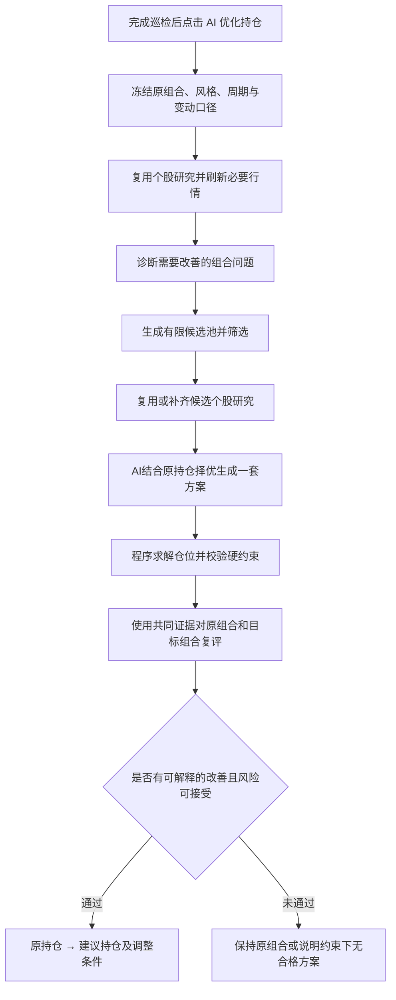

# 持仓 AI 优化方案

状态：已在开源版实现，待提交。设计日期：2026-10-04；实现日期：2026-10-05。

2026-10-05 数据校验修复（`portfolio-optimization-v2`）：新浪日线仅提供成交量，不能用缺失成交额判定股票不可调整。优先采用带真实交易时点的实时成交量与成交额；其他数据源须提供同一有效交易日的完整成交数据。目录抓取日期不能代替成交日期，也不通过价格乘成交量估算成交额。资格记录保存成交日期、数据源与具体缺失字段。旧版优化记录保留并提示重新优化，不能直接应用旧版方案；24 小时内有效研究继续复用。

验证：真实新浪行情的 20 只测试股票均获取到最近有效交易日成交量和成交额，12 只通过条件性资格核验；其余因 ST 或接近涨跌停等限制被排除。回归覆盖日线缺成交额、实时数据完整、过期/非有限行情、无成交、未知目录、风险股票，以及旧版任务重新开始和恢复。人工实时检查：`EASY_STOCK_LIVE_OPTIMIZATION=1 go -C backend test ./internal/portfoliooptimization -run TestLiveSinaOptimizationLiquidity -count=1 -v`（仅查询公开行情，不启动 AI 研究）。

目标：在已完成的持仓 AI 巡检报告中增加「AI 优化持仓」入口，按照原交易风格、持有周期、现有仓位和个股研究形成新的目标组合。允许新增、清仓、增持、减持；保持总股票仓位及现金比例，限制相对原持仓的变动，并在结果页展示「原持仓 → 建议持仓」。

合理性通过可复算约束、逐股研究、可比较的前后评估和执行条件来验证。系统可以保证校验过的方案满足仓位规则，不能保证未来收益或将模型分数提升视为盈利证明。

## 1. 70% 变动限制的口径

用户已确认口径：**被替换的资金不得超过原股票仓位的 70%，卖出与再买入只计一次，至少保留原持仓 30% 的配置权重**。所有界面、后端与记录使用同一口径，不能将卖出和买入重复计数。

设原组合、新组合股票代码的并集为 U，`o_i` 为原股票仓位、`n_i` 为目标股票仓位，均为占总资产的比例。新股票原仓位为 0，清仓股票目标仓位为 0。

```text
P = Σ o_i                          原总股票仓位
Σ n_i = P                          总股票仓位守恒
cash_new = cash_original = 100 - P
S = Σ max(o_i - n_i, 0)             清仓/减持资金
B = Σ max(n_i - o_i, 0)             新增/增持资金
S = B                              资金来源与用途相等
R = S / P = Σ |n_i - o_i| / (2P)    替换比例
R ≤ 70%
Σ min(o_i, n_i) ≥ 30% × P          保留的原持仓权重下界
```

保留权重下界描述目标组合与原组合的重叠，不等于必须保留 30% 的股票数量，也不等于检查实际成交的每一笔订单。

例如原总仓位 80%，最多将 56 个总资产百分点从原持仓移出并重新配置，现金仍为 20%。总仓位为 100% 时，最多替换 70 个百分点；总仓位为 50% 时，最多替换 35 个百分点。

第一版沿用现有 1% 的仓位输入精度，所有仓位和约束使用整数运算：建议口径下直接检查 `100 × S ≤ 70 × P`。展示可以保留小数，校验不能依赖显示后的四舍五入。总仓位为 0 时不生成建仓优化方案。

每份报告记录 `change_budget_mode=replacement_share`、比例上限、原始组合指纹和约束版本。再次优化已优化的报告时，默认继续以该优化链的初始组合计算累计变动，避免两次各替换 70% 绕过原上限。用户实际执行并录入新持仓后，才可明确将其设为新的基准。

## 2. 报告入口与任务流程

- 在组合判断卡片的操作区增加「AI 优化持仓」，沿用个股报告的按钮和卡片样式。
- 直接使用该报告的风格、周期、股票、仓位与成本，无需重复填写。
- 成功且四维评分完整的巡检可直接开始；不完整报告提供「先补齐巡检」入口。旧报告需要刷新研究时先完成巡检更新，再进入优化，原持仓输入继续保留。
- 优化前校验报告适用性，刷新报价并标明最近交易时点；周末、节假日按最新有效交易日判断报价时效，不能仅因墙钟超过 24 小时判行情不可用。
- 保留原报告原文；优化拥有独立任务、结果和历史记录，绑定原报告及初始组合。



进度显示实际阶段、候选数量、复用与新研究数量，允许离开页面继续后台运行。失败后只恢复缺失研究或方案/复评阶段，成功的个股报告继续保留。

## 3. 新增股票的来源与资格

优化先回答原组合需要改善什么：单票过重、共同交易主线集中、逻辑薄弱、周期不匹配、缺少互补角色等。新增候选须解释要解决的具体问题。

当前使用纯代码候选流程（`portfolio-optimization-v19`）：

1. 从完整行业动量列表中筛选温和初启行业：近 5 日上涨 0.5%–8%、近 20 日涨幅 -5%–15%、最新交易日上涨 0%–4%，且近 5 日动量强于此前 15 日折算的 5 日平均涨幅。按启动评分取前 16 个细分行业，通过实际行业成分接口取股票，不跨来源按行业名称猜成员，不仅选择涨幅最高的行业龙头。无法核验 5/20 日字段的备用行情不用于初启判断。
2. 从这些行业成分中按成交额优先、按已核验的来源板块轮流形成最多 80 只待检查股票（银行子行业合并为银行）；原持仓不占候选名额，ST/退市风险提前剔除。可选用户股票也必须属于已核验的初启行业成分，不能绕过规则。
3. 在 3 分钟总预算内分批核验最多 80 只股票的最新报价、21 个收盘样本和两期已公开财务报告，全部由代码执行。上一已收盘交易日涨停/跌停、近 20 个交易日累计涨幅大于 50%、关键数据缺失或交易资格不明均排除；盘中“昨天”取上一收盘交易日，节假日取最近有效收盘日。
4. 财务健康要求最新期净利润、扣非净利润、ROE、每股经营现金流为正，前一期净利润与扣非盈利也为正。成长通道：高增长为最新期营业收入同比至少 20% 且前期同比为正；稳健增长为连续两期同比至少 5%。v20新增并行估值通道：两期营收同比≥-5%、归母/扣非利润同比≥-20%、扣非/归母≥50%，最新有效交易日PE(TTM)≤25、PB≤3（银行12/1.5），且均为正。不要求高增，缺测不当零增长，区间仅供初筛。使用累计报表中各报告期的同比字段，不跨不同报告窗口直接做环比。当前数据源的营业收入和扣非盈利是主营增长代理，不冒充主营分项收入；界面保留口径。最近报告期超过 270 天、公开日期未知或晚于分析时点时不通过。
5. 淘汰后继续补选，保留最多 8 只合格候选，同时按来源板块和目录行业分散，最多取六个不同的目录行业进入标准个股 AI 研究，最多两只并发，24 小时内有效报告复用。合格行业不足 6 个时保留真实数量，不降低门槛、不填充未经筛选的股票。研究失败后剔除该股，保留其他成功研究。
6. AI 根据最多六只候选与原持仓的研究作最终选择，只生成一套方案；代码筛选通过不等于可以买入，可选择部分候选或保持原组合。独立复评、70% 累计替换限制与总仓位守恒继续生效。

筛选策略在 `portfoliooptimization.CandidatePolicy` 集中定义，每只候选保存筛选分数、增长类型、价格窗口、财务报告期/公开时间、数据源及淘汰原因。该信号不保证未来行业趋势。优化进度轮询只传阶段、候选和数量，完成时再加载完整报告，避免每 3 秒反复传输所有原个股报告。

研究复用继续遵守 24 小时规则，固定报告 ID、完成时间与证据截止时间；候选研究默认标准模式，共享已有运行任务。成功报告不等于允许买入：原报告为快速观察、`observe` 或 `no_plan` 时，可复用事实，但须补齐交易适用性核验。核验仅使用已有研究与必要新证据，不重跑全文研究；仍无法支持新仓的股票不进入新增方案。增持也须独立说明新增资金的依据，不能仅套用「原仓可以持有」。

## 4. 风格与约束的优先级

### 必须满足的约束

- 总股票仓位、现金比例与初始组合相同。
- 相对初始组合的变动不超限，所有权重非负、无重复代码，资金来源与用途相等。
- 股票属于已研究且通过资格校验的集合；清仓股票以 0 目标权重出现在对比中，提交新巡检时从目标持仓列表移除。
- 目标持仓数量不超过 10 只；最多新增 2 只。
- 新增和增持具备适合本次风格/周期的研究依据、确认条件和失效条件。
- 价格计划必须来自通过校验的研究锚点，不能另造入场/止损/目标价格。
- 已知不可交易的持仓须锁定或将方案标为等待条件满足，不能判为可立即执行。

### 风格目标与冲突处理

| 风格 | 优化方向 | 现有单票参考上限 | 原前三大仓位参考上限 |
| --- | --- | ---: | ---: |
| 激进 | 证据充分的交易主线、弹性和催化；容许更高波动并说明风险取舍 | 45% | 90% |
| 均衡 | 持有逻辑与风险平衡，降低过度集中，增加真正互补的角色 | 35% | 75% |
| 稳重 | 证据稳定、流动性、较低波动与清晰退出条件 | 25% | 60% |

上表比例占总资产，与当前 `ProfileRules` 保持一致。风格还包括共同主线暴露、风险承受、持有周期和证据质量，不只检查单票比例。

规则优先级为：用户固定总仓位与变动上限 → 数据/研究/交易资格 → 风格目标 → 改善程度 → 尽量少调整。

已有超限风险应尽量降低，新增/增持不得制造新的风格超限。受预算或锁定持仓影响无法完全消除时，明确标为局部改善，列出残余超限和最少需要释放的约束；不能偷偷放宽用户约束或判为完全合规。

总仓位固定也意味着现金不能变化。例如稳重风格但原组合满仓，优化无法满足原规则的 10% 现金参考值，必须保留该风险说明。若固定仓位下无法形成合理方案，应返回「当前约束下无合格方案」。

## 5. 方案生成与合理性审核

### AI 给依据，程序负责仓位约束

AI 根据研究说明哪些股票适合保留、减持、退出或作为候选，给出组合角色、建议权重范围及引用。不得输出无证据的收益率/胜率预测。

程序在 1% 网格上分配权重并检查硬约束，可以使用受限搜索或整数优化。默认保留原组合为对照，只产生一套由 AI 择优决定的方案：可在现有股票中调权，也可纳入最多两只新增股票。合格方案中优先选择改善明确、调整较少的方案；70% 是上限，不是必须用完的额度。

模型格式修复不能修改原持仓、预算或证据。约束不通过的方案不进入「建议持仓」，不能通过随意归一化、裁切仓位后直接展示；程序重新分配权重后必须再次完整校验与复评。

### 同口径比较

优化前后采用同一模型配置、评分版本、研究证据集合、行情快照、风格和周期。原巡检报告的历史分数单独保留；本次左侧显示用共同资料重新评估的「原组合对比分」，右侧显示「目标组合对比分」。不能拿几天前的历史分数与新资料下的评分直接宣称提升。

评估模型不读取优化者的营销式解释或预设分数提升要求。使用成对评估，随机或固定可回溯的 A/B 顺序，减少「新方案天然更好」的偏向；记录输入、版本及评估结果。第一次评估已合格后不反复刷分。

共同驱动分组和单股风险事实先在原股与候选股的并集中确定，再按两套权重计算暴露。不能为原组合与目标组合分别任意改变风险分组而制造改善。相关性只用相同交易日有效样本，样本不足保留未知。

### 输出合格方案的条件

- 硬约束、股票资格与证据引用全部通过。
- 至少针对一个原已识别问题给出可检查的改善，例如最大单票仓位下降、共同驱动暴露下降，或转入有更充分且适合本次周期的持有逻辑。
- 四维比较须解释收益与代价。只有分数涨几分、缺少事实改善时，不标为优化成功。
- 均衡和稳重方案应避免新增重大风险或明显牺牲风险承受；激进方案可提高弹性，但必须处于允许的风险边界并明确新增风险。
- 新增/增持条件、退出条件及相应减持资金来源完整，不能重复使用同一笔卖出资金。
- 行情、证据或交易资格存在关键缺口时，结论为「待核验」；事实不明不能算作已改善。

结果分为「有可采纳方案」「需等待条件」「本次未调整」「未生成可行调整方案」「研究/评估未完成」。没有调整不代表原组合评分合格或已通过优化推荐，不强迫 AI 调仓。

## 6. 左右对比结果

页面继续使用持仓/个股 AI 报告的界面风格，原报告主体上增加独立的优化结果区域。

顶部展示风格、周期、原总仓位、目标总仓位、现金、替换比例、约束检查和方案状态。例如：`均衡 · 波段 · 总仓位 80% → 80% · 现金 20% → 20% · 替换 25% / 上限 70%`。

桌面为两个等宽面板，中间箭头；两侧按股票代码对齐，采用原持仓顺序，再追加新股票。清仓股票保留在对比中，新增股票左侧显示未持有。手机端上下排列、向下箭头，仍逐股对齐。

示意数据，非实际股票建议：

| 原持仓 | → | 建议持仓 | 变化 |
| --- | :---: | --- | --- |
| 股票 A 30% | → | 股票 A 20% | 减持 10 个百分点 |
| 股票 B 20% | → | 股票 B 25% | 增持 5 个百分点 |
| 股票 C 20% | → | 股票 C 20% | 保持 |
| 股票 D 10% | → | 股票 D 0% | 清仓 |
| 股票 E 未持有 | → | 股票 E 15% | 新增 |
| **总仓位 80%，现金 20%** | → | **总仓位 80%，现金 20%** | **替换 20/80 = 25%** |

每项调整可展开查看「为什么调整」「新增资金依据」「研究来源」「确认/失效条件」「执行限制」。清仓仅作为目标仓位为 0 的计划，不能假称已经卖出。

下方展示四维评分、风险等级、最大单票、共同驱动暴露、有效相关性和证据覆盖的前后对照；不知道的指标显示未知。具体历史收益、未来组合回撤和收益提升金额不在没有依据时展示。

提供「查看新增个股研究」「使用该方案发起新巡检」「保留原组合」。新巡检/草稿与原报告建立关联，原报告和原持仓可回溯，不接证券交易接口。再次基于目标方案优化时继续按初始组合计算预算。

## 7. 成本与执行条件

- 原始成本作为单独事实保留，不把浮亏当作继续持有或补仓的充分理由。
- 保持/减持可继续展示用户记录的原每股成本；新增/增持后的成本待实际成交确认，不能把当前报价当成已成交成本。
- 使用目标方案发起新巡检时，新增股票成本为空；增持股票要求重新确认成本，原成本以来源信息保存，避免直接当成新的综合成本计算盈亏。
- 因没有资金总额、可卖数量、买入日期及券商成交信息，第一版输出目标权重和条件化调整，不生成可直接下单的股数，也不声称已核验 T+1 或资金冲击。
- 涨跌停、停牌等限制和等待入场条件会影响两边资金配对。对应买入未满足条件时，不把卖出和再买入视为已完成；明确整个方案为条件性目标。总仓位守恒指同一估值口径下的目标比例，不承诺逐笔成交过程、费用和价格变化后的实际仓位始终精确相等。

## 8. 后端边界与持久化

建议增加独立 `portfoliooptimization` 服务，复用现有研究解析、组合事实与评分校验，不把优化逻辑混入巡检的正常完成流程。当前另有通知功能的未提交改动，后续实现需要保留并检查接口兼容，不覆盖并行工作。

API 草案：

| 方法 | 路径 | 功能 |
| --- | --- | --- |
| POST | `/api/v1/portfolio-inspections/{id}/optimizations` | 基于指定原报告启动/复用优化任务 |
| GET | `/api/v1/portfolio-optimizations/{id}` | 查询进度和对比结果 |
| GET | `/api/v1/portfolio-inspections/{id}/optimizations` | 查看该报告优化历史 |
| POST | `/api/v1/portfolio-optimizations/{id}/cancel` | 停止自己的等待/评估 |
| POST | `/api/v1/portfolio-optimizations/{id}/resume` | 恢复缺失研究或评估阶段 |

新增 SQLite 优化任务表，保存原报告/初始组合引用、任务状态、约束及版本、输入指纹、候选来源/淘汰原因、研究报告引用、行情时点、备选方案、程序约束检查、前后评估、最终结果及实际耗时。原报告删除不能破坏已经保存的优化来源，可保存必要输入快照，禁止依靠「最近 30 条报告」重建。

同一输入指纹只运行一个优化任务；重复点击接入该任务。成功结果重复查看不重新研究。候选研究沿用全局并发 2，取消优化只取消等待，不取消被其他任务共享的个股研究。

正常完整巡检之后启动的优化任务建议总预算 24 分钟，包括排队、采集及模型阶段。候选采集有独立短超时，最多 3 份标准研究；方案生成和成对复评各有独立 8 分钟模型预算，格式/一致性修复最多一次并计入所在阶段剩余预算。不能承诺排队情况下总能完成；预算结束保存有效报告和检查点，可恢复。需要整体刷新原巡检的旧报告先走原巡检流程，其耗时单独显示。

## 9. 实现和验收

按以下顺序落地：

1. 固化用户选择的变动口径与版本，实现权重、资金守恒、累计变动及股票集合校验。
2. 接入候选来源、交易资格和研究复用，补齐新增/增持的适用性核验。
3. 实现有上限的方案生成、程序分配权重、共同资料下的成对复评与不采纳结果。
4. 增加后台任务、取消/恢复、存储和 API，再完成报告入口及左右对比。

关键验收：

- 原总仓位 80%，目标必须仍为 80%，现金仍为 20%；任何总仓位增减都被拒绝。
- 原总仓位 80% 时，卖出并买入 56 个百分点通过变动预算校验，57 个百分点拒绝；原总仓位 50% 时，35 通过、36 拒绝。通过预算校验的方案仍须通过其余股票资格与风格检查。
- 新增、清仓及旧股增减全部进入统一股票并集，重复代码或舍入不允许绕过预算。
- 连续两次优化的累计变动仍相对初始组合计算，不能逐次重置限额。
- 24 小时内已有成功研究只复用，候选缺少合格报告才研究；失败快照不算成功研究。
- `observe`/`no_plan` 不自动成为新仓依据；未知交易状态、虚构引用、无锚点交易价格必须被拦截。
- 同一行业下不同实际驱动与不同公司下同一主线，都正确进入共同驱动评估；新增同主线股票不会被判为有效分散。
- 满仓稳重组合无法通过优化获得现金缓冲，须保留缺口说明；单票上限与预算冲突时不改用户约束。
- 对照评估使用同一证据与行情；只有 AI 分数变化而没有具体改善时，不输出成功优化。
- 没有合格新增股时允许仅调权或保持原组合，不凑股票、不强迫用完预算。
- 源报告与成本信息不被覆写；新方案不能伪造已成交成本，应用方案仍保留历史关联。
- 失败/取消/恢复不重复研究成功股票；前端正确展示未完成、无改善、受约束和等待条件等结果。
- 桌面左右与手机上下对比均覆盖新增和清仓行，所有比例与后端复算一致。


## 10. 已落地实现与当前边界

后端使用独立的 `portfoliooptimization` 服务和 `portfolio_optimization_jobs` SQLite 表，保存来源快照、初始基准、资料、候选、检查点、方案和成对复评。上述五个 API 已接入。巡检请求增加 `source_optimization_id`，使用目标方案时校验来源和权重，后续优化继续沿用初始基准。研究来源不依赖界面的历史记录截断。历史接口仅加载最近20条摘要，选中记录时再读取完整快照；启动只恢复正在运行的任务，不重读全部历史报告。

仓位采用整数网格动态规划，在 AI 提出的证据范围内分配；程序检查资金守恒、累计 70% 上限、新增数量、交易锁定和风格超限。累计替换额度相对初始基准；本次卖出/买入及逐股资金配对另按当前巡检组合计算，每份释放资金只分配一次。程序分配后的方案重新独立复评；不存在仅归一化后直接标为成功的路径。可复算改善目前支持：超过参考值的最大单票、前三大仓位、共同驱动集中下降，以及有限/不足证据的持仓占比下降。仅有分数提升或其他无法复算的主观改善，不予采纳。

资料准备确认最近有效交易日的报价和成交信息，覆盖周末与本地交易日历中的节假日。股票目录抓取时间不会被当作底层成交日期。资料或交易资格不明的持仓限制调整；新增/增持限制更严格。候选来自通过温和初启筛选的真实行业成分，按成交额优先并跨行业轮流收集；用户输入也须通过同样的行业与个股筛选。最多80只代码检查、3分钟总预算，保留最多8只合格候选，并核对来源板块和目录行业去重后取最多六只进入个股AI研究；行业初启是量化筛选信号，不作为最终交易驱动结论。近期研究索引仅用于复用报告，不绕过候选筛选。

第一版新增/增持要求充分、同周期的成功研究，以及来源支持的确认/失效条件和增量资金理由。`observe` 可以复用事实并在方案阶段作聚焦适用性核验，再接受独立复评；`no_plan` 和证据不足报告继续禁止新增/增持，不通过重新解释强行解锁。可能因此返回保持原组合。这一保守边界不保证每次都能得到调仓方案。

评分保留原巡检历史分，与统一资料下的原/目标对比分分开。共同研究和行情只输入一次，两边共享评分规则；复评不读取优化者的建议权重、资金理由或预设提升分数。共同风险分组冻结，暴露由程序计算。结果始终是条件性配置，不代表已经成交；成本、T+1、股数、费用和实际买卖配对仍需成交前核验。

任务单次运行总预算24分钟，方案及成对复评各有8分钟模型预算、至多一次格式/一致性修复，计入所在阶段预算。取消不取消共享个股任务。手动恢复保留成功研究和完成的复评，仅给缺失阶段新的运行预算；过期原巡检须先刷新。进入新有效交易日时重冻报价并复评，不复用旧行情下的方案检查。无法保证排队/数据服务/模型故障时在预算内成功，但会保存有效检查点。

前端提供报告按钮、可选候选输入、历史、进度、停止/恢复、未采纳说明、桌面左右/手机上下对比，逐股展示新增/清仓/增减持、资金、研究来源和条件。使用目标方案发起新巡检时清空新增/增持成本，原报告和成本保留。

验证包含后端边界/恢复/复用/来源/条件/链基准/API测试、前端测试与构建，以及 `scripts/verify-portfolio-optimization-ui.mjs` 的隔离浏览器流程测试。浏览器使用标明的假数据，不调用真实 AI 或交易服务；AI结论质量仍受模型及实际证据影响。


## 11. 2026-10-05 超时排查与行业分散（v4）

实际 v3 任务 `po-1791174223010788000` 在 12:23:43 开始，三份候选研究全部成功、原四份研究复用，12:35:57 进入方案生成，12:43:57 在 8 分钟模型预算处超时；尚未生成方案或进入复评。候选研究约 12 分 14 秒，失败点为方案生成，而非行情筛选。模型为 `glm-5.3-flash`，任务使用最高思考强度；旧版没有记录优化模型输出进度，不能据此认定无响应或正文为零。

v4 将股票目录行业作为统一去重口径，合并国有大行、股份制银行、城商行和农商行；最终同一行业最多一只。前置候选也按统一行业轮流收集，最多核验八只。行业未知不进入 AI 研究；不足三个合格行业时不凑数。新版本使旧候选/方案检查点失效，保留有效个股报告供复用。

方案和复评输入改为精简研究摘要，保留证据等级、结论、反证、周期、原用途、条件 ID、失效条件与来源引用；原完整报告不修改。没有持仓且因证据不足或 `no_plan` 被禁止接收新资金的候选，仅提供排除理由与证据摘要，无需重新生成交易计划。代码明确标出研究允许的权重上限，模型不能解释解锁。总仓位、累计替换、价格锚点和独立复评校验继续使用原始研究。

每次模型调用保存阶段、输入/输出字节数、耗时、思考/正文进度和错误，进度轮询显示当前阶段的模型响应情况，超时提示明确生成方案或复评。保持现有 24 分钟总预算、方案与复评各有独立 8 分钟预算以及用户配置的模型思考强度；精简输入不等于保证模型总能按时完成。


## 12. 2026-10-05 输入去重与阶段预算（提示词 v5）

实际 v4 任务 `po-1791177614549882000` 的方案业务输入为 88,654 字节，用时 285 秒；复评输入为 115,888 字节，用时 195 秒后超时，已收到 32,321 字节思考、正文为零。原实现两阶段共享 480 秒，因此复评仅剩约 195 秒。输入统计为 UTF-8 业务提示词字节数，未包含运行时系统指令，不能当作模型完整上下文或 token 数。

优化使用独立模型 DTO，不再序列化完整研究对象。共同个股事实只发送一次，A/B 只携带仓位、组合事实和冻结驱动的暴露。核心判断保留至少60字，反证与驱动保留至少30字，避免为压缩输入而只留下价格开头；去掉重复的冲突/支持叙事和被禁止收取资金候选的量化事实。独立复评只包含 A/B 实际持有的股票，只生成四维评分与采纳判断；逐股结论和确认/失效条件从原研究投影，不生成两套完整报告或虚构组合情景。普通持仓巡检仍要求完整情景。两种评分共享引用、价格、风险去重、集中度和风格校验。仅分数提高仍不能使方案被采纳。

条件与来源采用一次列定义的表格行，保留可配置股票的全部条件 ID、数值阈值、原用途、周期、证据等级及来源时效。禁止接收新资金的零仓位候选只保留排除依据。初次业务输入最大 24 KiB，为一次格式修复预留空间；所有模型调用包括修复均硬性限制 32 KiB，必要证据仍超限时保存报告并明确失败，不发送超大输入。保存模型阶段、实际输入字节、调用预算及耗时，界面可以展开查看。

每个模型阶段独立计时，修复计入所在阶段的 8 分钟预算，父级 24 分钟总预算优先。恢复保留有效个股研究和已保存方案，重跑缺失的复评；不调整用户的模型或思考强度。最新保存任务的提示词审计测得：方案 24,383 字节，复评 24,479 字节。


真实复评进一步发现匿名顺序问题：当 A 为目标、B 为原组合时，旧 `accepted` 判断默认将 B 当作目标，导致理由中的资金方向反转。新版要求盲评输出 `preferred_configuration=a/b/neither`，程序根据已保存顺序映射是否偏向目标；模型不得自行推断新/旧组合。两种顺序、偏向原组合、均无改善及缺失选择均有测试。页面显示复评 A/B 与原/建议持仓的对应关系。接受仍必须通过实际改善及风险边界校验。

输入去重版本纳入任务指纹，点击重新优化不再返回旧版失败/成功缓存。旧版成功方案保留历史展示，应用前要求新版明确选择与映射；已失败任务仍可恢复已保存方案，直接重跑新版复评。

最终真实重放使用同一 `glm-5.3-flash` 模型与最高思考强度：复评首轮输入 24,479 字节，用时 228 秒；一次校验修复输入 31,549 字节，用时 78 秒，合计 306 秒，仍在本阶段 480 秒预算内。最终通过引用、评分与风险边界校验，返回条件性方案。测试仅用内存存储和临时运行目录，不修改用户原任务、报告、设置或持仓；不保证模型每次都能在预算内完成。


## 13. 优化进度与结果位置

优化区域嵌入巡检摘要下方、原报告四维评分上方。准备资料、筛选候选、个股研究、生成方案、独立复评、完成六个节点保持一条水平线；当前节点高亮，实际完成的节点打勾，未执行的独立复评以灰色短横线标明「未执行」，停止或失败保留停留节点及恢复操作。流程结束后展示原持仓与建议持仓对比，桌面左右、窄屏上下；评分、调仓依据、候选来源和模型记录折叠展示。没有可采纳方案时先展示原因，右侧标明「原持仓（暂未调整）」与「本次未生成新组合」，未采纳方案另放折叠区，未完成草稿不作为建议配置展示。

## 14. 2026-10-05 证据与行情时效修复（v5，提示词 v6）

旧研究校验将超过 5 个自然日的日线同时降为 `insufficient/no_plan`，导致国庆期间 9 月 30 日行情误判过期；充分评级还统一要求公告正文，即使判断仅涉及财务和量价。本版共享交易日历，研究与候选资格均以最新已完成交易日判断时效；公司证据质量和当前交易可执行性分开处理。真实过期或无效行情仍阻止交易计划，冲突财务仍需核验，不为调仓放宽证据门槛。新个股研究使用东财与新浪多期数据补充、同口径交叉核对和明确缺失字段。

24 小时内的成功 v7 个股报告可从原模型输出和冻结快照重新校验，不再重复调用 AI；保留原报告、完成时间与证据截止时点，既不刷新有效期，也不补造新财务资料。没有可核验原输出时维持保守结论。新优化版本纳入任务指纹，重新优化不返回旧版完成结果；原优化历史仍保留。

固定总仓位下，若原股与候选均不能接收新增资金，结果明确为「未生成可行调整方案」，列出各股交易资格、证据、周期或计划阻碍，原持仓暂未调整不表示推荐全部保留。相同权重方案不执行独立复评，页面也不显示复评成功。总仓位守恒、相对初始股票仓位最多替换 70%、每模型阶段最多 8 分钟和总计最多 24 分钟继续生效。

## 15. 已实现：以投资价值与组合角色决定配置（v6，提示词v7）

2026-10-06 已将盈利质量、增长来源、估值、量价位置、组合角色与实际风险接入方案，同时比较旧股增持和新股配置。报告评级与observe/no_plan不再决定增持权限；新配置需要退出，等待买点需要入场观察。具体投资改善即使不降低集中度也可进入匿名独立复评，纯投资改善必须由复评独立确认资金方向及改善维度；评分变化不单独决定采纳。此前三档资金权限和试配资金池设计撤回。总仓位、累计70%替换、行业分散、交易资格、风险及输入/时间上限保留。完整规则与验证边界见 [投资价值与组合角色选股方案](portfolio-investment-selection-design.md)。旧v5任务保留，重新优化使用v6，不复放旧禁止结果。

## 16. 组合评分至少70分（v7，提示v15）

采纳同时要求独立四维综合评分≥70、实际投资/结构改善及风险资金检查通过。低分只允许根据具体缺陷改进配仓一次，复用冻结研究与事实；风险组和累计替换基线不变，同目标不重新抽样评分。所有轮次共用24分钟，阶段最多8分钟，格式修复预算不重置。仍未达标时保留原持仓、显示真实分数并禁用目标应用。详见[投资价值与组合角色选股方案](portfolio-investment-selection-design.md)。


## 17. 达标方案采纳一致性（v18，提示v26）

最终独立复评按实际净减持→净增持方向核验投资改善，允许使用与提案不同的资金配对或维度，仍要求双方真实引用和明确代价。AI共同标签继续供复评判断，只有实测强正相关确认的分组或子配对才参与数值集中度硬限制；求解与最终验收共用边界。高分但其他检查失败时允许一次有界范围改进，并直接展示具体拒绝原因。完整规则及历史规则的替代范围见[投资价值与组合角色选股方案](portfolio-investment-selection-design.md#2026-10-07修复达标方案的采纳误拒v18--提示v26)。


## 18. 初始范围修复（v19，提示v27）

初始程序配仓模式区分内容错误与数值范围无解。投资内容合法但min/max不能形成固定总仓位时，仅增加一次范围补丁调用，冻结已校验投资决定，向模型提供代码可行参考及实际上下限；它与格式修复分开计数，继续共用原阶段、总耗时和输入预算。不可自动扩大模型可接受上限、归一化仓位、改变现金或给排除股分配资金。完整约束和独立复评仍是必经步骤。详见[当前投资价值选股方案](portfolio-investment-selection-design.md)。
