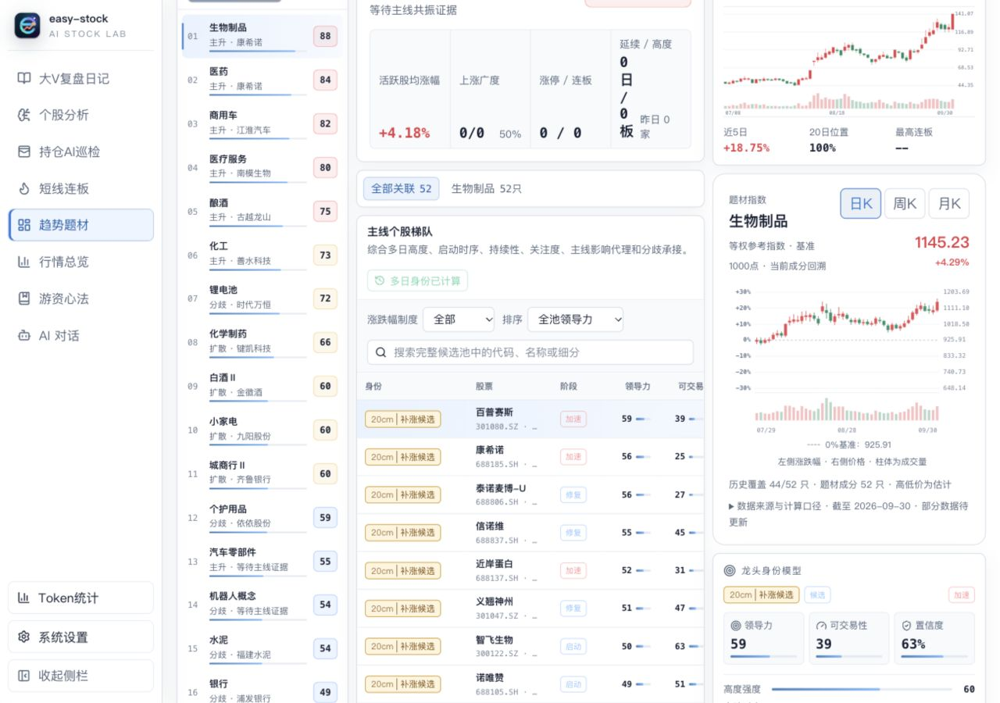

# 题材指数 K 线（Issue #11）

## 口径与准确度

先按板块代码、唯一的精确名称或已维护的题材映射寻找来源指数。禁止模糊包含匹配，不能拿宽行业冒充窄题材；来源图展示其实际名称与代码。来源指数保留原点位及编制方法，无需加载成分股。

没有可用来源指数时，冻结当前关联成分，去重后取前复权日线，计算等权参考指数。设昨日指数为 I、成分昨日复权收盘为 C，今日价格为 P，则今日指数价格为 I × mean(P/C)。以历史窗口基准日收盘1000点开始逐日链接，返回并显示基准日；窗口滚动会重标点位，涨跌幅口径不变，名义股价与市值不影响权重。拆股分红由前复权处理；不混入新浪未复权历史。备用源仅接受腾讯 qfqday。

开收盘在相应时点可以按这个公式计算。各股最高、最低发生时间不同，平均各股日内极值仅构成指数极值包络，不能视作真实指数高低点。界面明确显示“高低价为估计”。成交量、金额只合计已加载成分，不按抽样比例放大。

当前成分向历史回溯存在成分变更及存活者偏差，不适合无前视偏差回测。上市首日以前不纳入；内部缺失交易日按停牌平价延续，缺失并不能完全证明停牌，因此仍属于参考口径。历史末尾不平价填补；某日有效覆盖不足80%时截断其后的整段走势，避免遗漏收益后错误拼接。

## 性能与抽样

每只股票最多301根日线。当前成分不超过128只时全量加载；更大题材以 SHA-256(theme ID, canonical symbol) 排序，均匀抽取32只起步，按32只扩样至128只。抽样不依赖涨幅、龙头排序、市值或前端分页。

检查最近20日横截面收益的抽样标准误：1.96 × sqrt(sample variance / n × (N−n)/(N−1))。目标日收益误差参考值为0.20个百分点。达到目标停止扩样；未达到时展示实际误差，不承诺达到目标。该估计依赖当前样本代表性和可用历史，不能保证累计走势误差，也不是自适应停止后具有严格覆盖率的置信区间。

仅当主动抽样、所选股票全部取回，且最近20个交易日全部纳入样本时才提供误差参考值。取数失败和历史尾部缺失可能不是随机发生，不能套用均匀抽样误差。`history_coverage` 表示已加载/已选择的股票数；`minimum_coverage` 表示已加载、已上市股票在各交易日的最低有效覆盖率，二者分别报告。全量尝试但部分历史缺失时，明确提示可能存在偏差；只有实际截断走势才显示截断提示。

总请求限时20秒、全服务最多6个并发股票请求。主备复权源分别限时2秒；主源连续失败3次后暂停30秒，避免对每只成分股重复等待失效源。5分钟题材缓存、股票缓存及同键请求合并，交叉题材复用股票历史；板块目录缓存6小时。缓存上限32个题材、512只股票；失败缓存15秒，取消不缓存。原始日线一次取回，前端本地聚合周/月K，无额外行情请求。历史规范化排序为 O(N T log T)，收益累加与覆盖计算为 O(N T)，T≤301、N≤128。

## 产品与接口

在右侧个股日K下方、龙头身份模型上方增加题材指数图。显示日/周/月K，日K只展示最近45个交易日；周月K仍使用完整日线窗口聚合。提供OHLC悬浮信息、来源指数名称/代码，或合成口径、成分覆盖及抽样误差。题材切换取消旧请求，防止旧题材曲线串入新题材；图表独立加载，不阻塞主线或个股列表。

`GET /api/v1/themes/index?theme=...&snapshot_id=...&limit=240`，最多300根日线；过期题材快照返回410，历史覆盖不足返回明确错误。结果包含 lines、method、quality、warnings 和 source meta。

`refresh=1` 重建题材结果并立即重试失败历史，复用仍有效的成功股票缓存；请求取消后不保存未完成的结果。来源接口必须显式提供前复权数据，题材算法不继承可被替换为未复权源的普通个股K线配置。

## 验证记录

2026-10-06，Apple M2，Go benchmark：128只股票、300个交易日合成约14.4毫秒，分配约12.2MB；240根K线的缓存命中约5.2微秒（不含HTTP序列化与传输）。真实生物制品题材首次请求约4.7–5.1秒、缓存请求约3–5毫秒，52只成分中44只有可用前复权历史；实际覆盖和缺失偏差会显示在界面，不能将它当作完整题材指数或实际误差上限。这些耗时是本机测量，取数时间随上游状态变化。

后端全量测试、题材算法/HTTP接口/相关行情源/题材映射竞态检查、前端174项测试与生产构建通过。回归覆盖等权收益、名义股价尺度不变性、复权除权、上市对齐、停牌延续、尾部缺失、非交易日、均匀抽样扩容、缺失历史质量提示、缓存请求合并与取消重试、周月聚合。真实界面验证日周月切换、题材切换清空旧曲线及较窄面板下的完整坐标轴显示。

